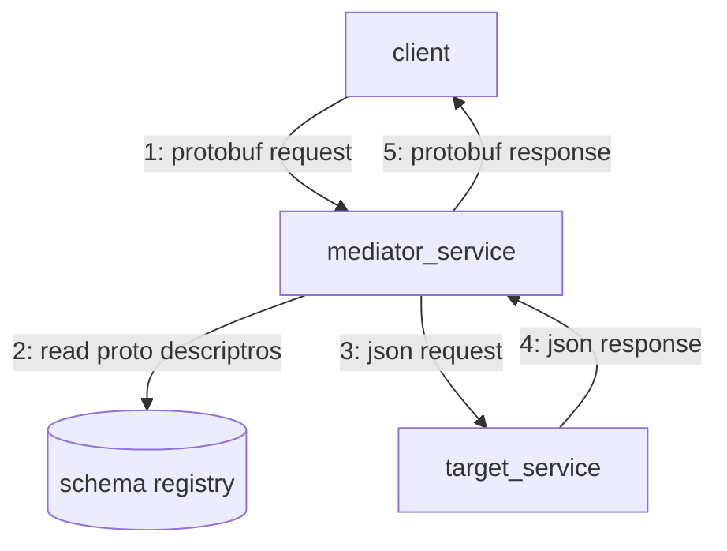
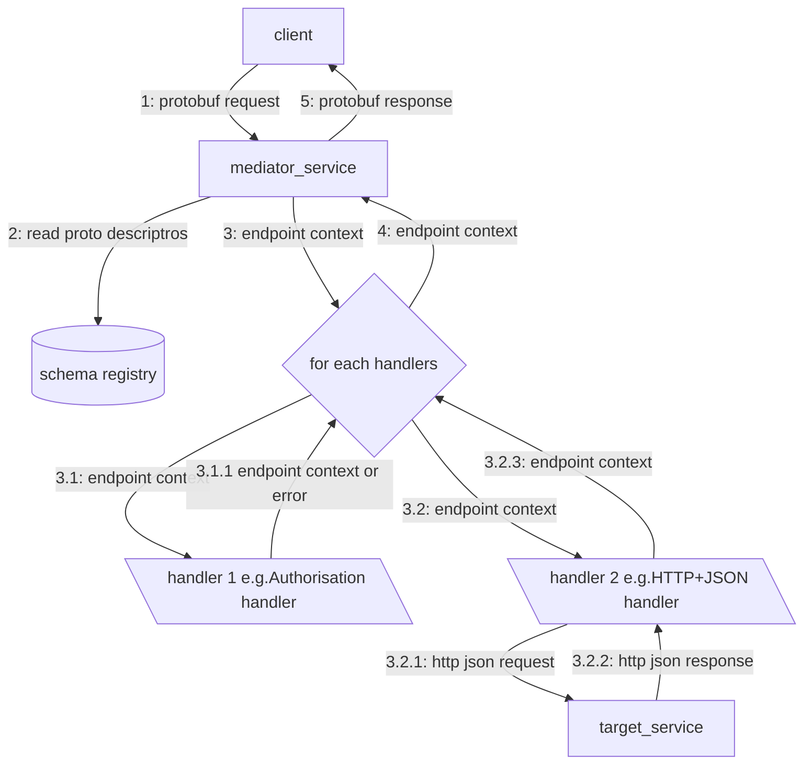

# Disclaimer:
> **_NOTE:_**  This is my one of the firs t encounter with go and gRPC so the quality of code may be very poor. It may contains traces of my C# and OOP based background.

# GRPC Mediator Service
This service is a gateway to provide gRPC interface to non-gRPC APIs e.g. HTTP+JSON. Multiple handlers of the request and response can be added to  the pipeline e.g. logging, checking permissions, calling backend API to process request and return response.



The service uses a concept of handlers employs [Open-Closed principle](https://en.wikipedia.org/wiki/Open%E2%80%93closed_principle) to allow extend behavior without modifying existing code. Handlers are a series of operations that will be performed on the request and response in [chain of responsibility pattern](https://en.wikipedia.org/wiki/Open%E2%80%93closed_principle). More handlers can be added with a very small change (addition to the switch statement) to the pipeline code. As I learn more go, I would like to improve this part to remove any need to change the pipeline code.

## Handlers
Idea of handler is based on the ASP.NET Core middleware components that receives HTTPContext to process request and response parts. There is an interface defined that handlers must adhere to by implementing a "Process" method. This method receives context containing a value for EndPointContext.



```go
type Handler interface {
	Process(epCtx context.Context) error
}
```
Handler creation is performed by a method to abstract the creation from the service running the code. This can be enhanced to implement complete [Factory Method pattern] (https://en.wikipedia.org/wiki/Factory_method_pattern) when required

### Endpoint Context
Mediator service prepares the EndpointContext based on the mediator request fields and target proto options. Endpoint Context contains set of fields required by handlers to process the request and response:

```go
type EndpointContext struct {
	EndpointDescriptor protoreflect.MethodDescriptor //Method descriptor (reflection) for the target endpoint
	EndpointConfig     *gpb.EndpointConfig //Endpoint configuration options defined by the target endpoint
	Handlers           []Handler //Array of handlers appended in the required order of execution based on the EndpointConfig
	Request            *GRequest //Contains reference to the request message. Each handler can read, validate or enrich it
	Response           *GResponse //Contains reference to the response message. Each handler can read, validate or enrich it
}
```

This repository currently includes 3 handlers

1. HTTP Handler : Calls HTTP API by marshaling request to JSON and un-marshaling response from JSON
2. Entitlements Handler: Authorisation check
3. File Handler: For unit tests, it reads response from a local file with a static JSON content


### High Level Flow

1. Team defines custom protos (CP) for a backend service (BS)
    1. CP provides config for various handlers i.e. json on http
2. Client calls mediator service (GS) with CP request
3. GS parses CP and calls configured it to handlers
    1. http_backend converts CP to JSON and calls the backend service and returns converts JSON to CP and returns to GS
4. GS returns response in CP to Client

## Mediator Service

Mediator service accepts custom protos and returns custom protos based on the stream method. This service serves for all the service definition specified in its config and with protos available into its schema registry.
Mediator service expects the custom protos to decorate the endpoint with options configured in the gprotos.


At the centre of this service is the proto definition of the endpoints. A required set of handlers can be added to the Method definition for the endpoints in the proto file.

[US stats service endpoint proto message](/schemas/usstats/usstats.proto)

```protobuf
service StatsAPI {
  rpc GetStats(GetStatsRequest) returns (GetStatsResponse) {
    option (gservice.endpoint_config) = {
        entitlement_operations: ["appointments:read"],
        handlers: [
          {name:"entitlements",  options: [{key:"1", value:"appointments:read"}]},
          {name:"http-backend",  options: [
             {key:"auth_type",value:"JWT"},
               {key:"http_method",value:"GET"},
               {key:"url_pattern",value:"api/data?drilldowns={drilldowns}&measures={measures}"},
               {key:"host_config_key",value:"US-STATS"},
               {key:"body",value:"US-STATS"}
          ]}
        ],
    };
  }
}
```

Above proto definition provides an endpoint called "GetStats". It also specifies two handlers in the order of required execution i.e. check entitlements and target HTTP APi with type of authentication to use.

## Schema Registry

This project uses a very basic file-based schema registry. The following commands requires the following proto tools and plugins installed

- buf > `v1.2.0`
- protoc-gen-go
- protoc-gen-go-grpc
- protoc-gen-connect-go

```bash
# generate go code, outputs to {repo}/gen
buf generate

# generate descriptor sets, outputs to {repo}/descriptor-sets/pkg.Service.fds
buf build --type="{pkg.Service}" -o "gen/descriptor-sets/{pkg.Service}.fds" --as-file-descriptor-set
```

The mediator service uses the descriptor sets to discover endpoint definitions on application startup. These are read into the service from file and used as as proto descriptor source.

```go
	fdsFile := filepath.Join(*descriptorSetsDir, "pkg.Service.fds")

	fdsBytes, err := ioutil.ReadFile(fdsFile)
	if err != nil {
		return nil, err
	}
	descriptorSet := descriptorpb.FileDescriptorSet{}
	err = proto.Unmarshal(fdsBytes, &descriptorSet)
```


## How to define new target

#### 1. Define protobuf for the target service

#### 2. Specify required handlers in the endpoint options

#### 3. Generate schema registry

##### Local Schema Registry

```sh
cd schemas

buf generate

buf build --type "med8r.schemas.testservcies.usstats.v1.StatsAPI" -o "gen/descriptor-sets/usstats.v1.StatsAPI.fds" --as-file-descriptor-set 
buf build --type "med8r.schemas.testservcies.usstats.v2.StatsAPI" -o "gen/descriptor-sets/usstats.v2.StatsAPI.fds" --as-file-descriptor-set 
```


##### BUF Schema Registry
```sh
cd schemas\med8r
buf push

cd schemas\testservices
buf push

```
## Test

```sh
cd med8r
go test ./genericserver
```
## Run

```sh
# run the server
cd server
# to run with BSR
go run ./cmd/withbsr 
# OR to run with local schema registry
go run ./cmd/withlocal

# run the client (in another terminal)
cd client
go run ./cmd/gclient

```

client will call server with its proto definition will get response in expected proto

